# NexJob

NexJob is a web-based job search and recruitment platform designed to connect companies with job seekers through a simple, structured, and role-based system. The platform allows company administrators to manage job opportunities and enables users to search and apply for jobs efficiently.

# Project Structure

<pre>
NexJob/
│
├── index.html               
│
├── shared/
│   ├── About.html
│   └── Contact_us.html
│
├── company/                
│   ├── Dashboard.html     
│   ├── create_opportunity.html
│   ├── my_job_postings.html
│   ├── edit_job.html
│   └── company_settings.html
│
├── jobseeker/             
│   ├── findJob.html
│   ├── job_details.html
│   ├── apply_job.html
│   └── my_applications.html
│
└── auth/
    ├── login.html
    └── signup.html
</pre>

 

# Links Graph

